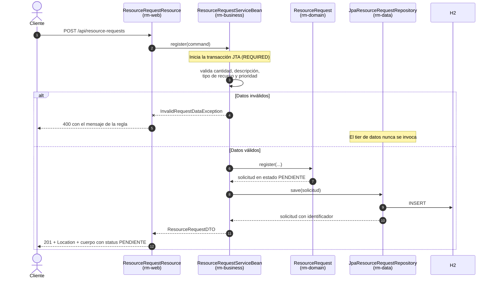

# 03 – Secuencia: registrar una solicitud

```mermaid
sequenceDiagram
    autonumber
    actor C as Cliente
    participant R as ResourceRequestResource<br/>(rm-web)
    participant S as ResourceRequestServiceBean<br/>(rm-business)
    participant E as ResourceRequest<br/>(rm-domain)
    participant P as JpaResourceRequestRepository<br/>(rm-data)
    participant DB as H2

    C->>R: POST /api/resource-requests
    R->>S: register(command)
    Note over S: Inicia la transacción JTA (REQUIRED)
    S->>S: valida cantidad, descripción,<br/>tipo de recurso y prioridad
    alt Datos inválidos
        S--xR: InvalidRequestDataException
        R-->>C: 400 con el mensaje de la regla
        Note over P: El tier de datos nunca se invoca
    else Datos válidos
        S->>E: register(...)
        E-->>S: solicitud en estado PENDIENTE
        S->>P: save(solicitud)
        P->>DB: INSERT
        P-->>S: solicitud con identificador
        S-->>R: ResourceRequestDTO
        R-->>C: 201 + Location + cuerpo con status PENDIENTE
    end
```

El rechazo ocurre antes de tocar el tier de datos. La prueba
`registerDoesNotTouchRepositoryWhenValidationFails` lo verifica con `verifyNoInteractions`.
